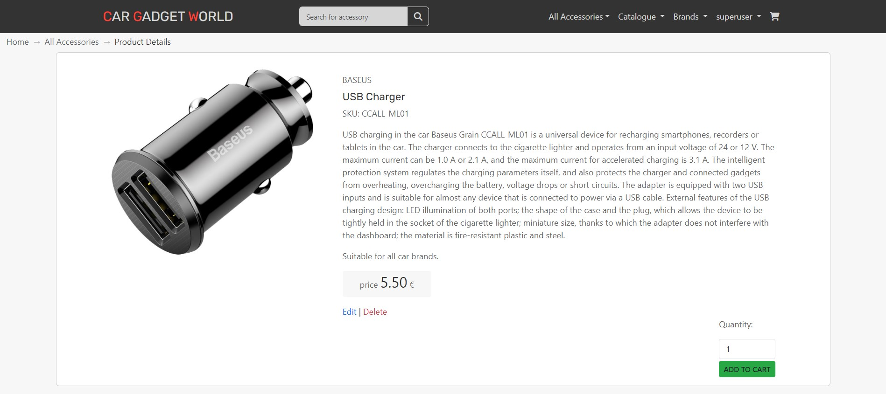
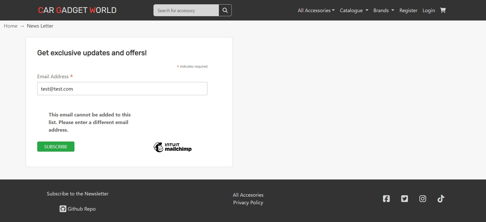

# Car Gadget World

[](https://car-gadget-world-605f69b77cdd.herokuapp.com/)
[Link to Live Site](https://car-gadget-world-605f69b77cdd.herokuapp.com/)


## Table of Contents

- [Car Gadget World](#car-gadget-world)
  * [Introduction](#introduction)
  * [User Stories](#user-stories)
  * [UX](#ux)
    + [Typography](#typography)
    + [Wireframes](#wireframes)
    + [Accessibility](#accessibility)
- [Features](#features)
  * [Existing Features](#existing-features)
    + [Landing Page](#landing-page)
    + [Navbar](#navbar)
    + [Shopping cart](#shopping-cart)
    + [Breadcrumbs](#breadcrumbs)
    + [List of All Accesories.](#list-of-all-accesories)
    + [Product Details Page](#product-details-page)
    + [Sign UP / Sign In](#sign-up---sign-in)
    + [Checkout](#checkout)
    + [Footer](#footer)
    + [Privacy Policy](#privacy-policy)
    + [Notifications](#notifications)
    + [Favicon](#favicon)
  * [Staff Only Features](#staff-only-features)
    + [Product Management](#product-management)
    + [All Accessories page](#all-accessories-page)
    + [Product Details page](#product-details-page)
  * [Custom Error Page](#custom-error-page)
  * [Features Left to Implement](#features-left-to-implement)
  * [Technologies Used](#technologies-used)
  * [Ecommerce Business Model](#ecommerce-business-model)
  * [Search Engine Optimization (SEO) & Social Media Marketing](#search-engine-optimization--seo----social-media-marketing)
    + [Keywords](#keywords)
    + [Sitemap](#sitemap)
    + [Robots](#robots)
    + [Social Media Marketing](#social-media-marketing)
    + [Newsletter Marketing](#newsletter-marketing)
  * [Testing](#testing)
    + [Browser Compatibility](#browser-compatibility)
    + [Responsiveness](#responsiveness)
    + [Performance Testing](#performance-testing)
    + [Accessibility Testing](#accessibility-testing)
    + [User Story Testing](#user-story-testing)
    + [Challenges Faced](#challenges-faced)
    + [Code Validation](#code-validation)
      - [HTML Validation](#html-validation)
      - [CSS Validation](#css-validation)
      - [Python Validation](#python-validation)
      - [JavaScript](#javascript)
  * [Deployment](#deployment)
    + [ElephantSQL Database](#elephantsql-database)
    + [Amazon AWS](#amazon-aws)
      - [S3 Bucket](#s3-bucket)
      - [IAM](#iam)
      - [Final AWS Setup](#final-aws-setup)
    + [Heroku Deployment](#heroku-deployment)
    + [Local Deployment](#local-deployment)
      - [Cloning](#cloning)
      - [Forking](#forking)
    + [Code](#code)
    + [Media](#media)
    + [Acknowledgements](#acknowledgements)

<small><i><a href='http://ecotrust-canada.github.io/markdown-toc/'>Table of contents generated with markdown-toc</a></i></small>


## Introduction

The project is an E-commerce site for a store that sells both universal accessories and branded ones for a specific car brand. The online store is specifically designed for car enthusiasts who value every minute spent behind the wheel, seek convenience and comfort, and aspire to stand out among other drivers.

Users, including guests, can view accessories, and only registered users can add them to their cart and place orders.

The project was built with Agile management principles in mind.

I wanted to create an interface for the business owner to manage the store without logging into the Django admin panel.

[Kanban Board for project](https://github.com/users/satogako/projects/6/views/1)

[Closed Issues on GitHub for the project](https://github.com/satogako/CarGadgetWorld/issues?q=is%3Aissue+is%3Aclosed)

I used [GitHub issues](https://github.com/satogako/CarGadgetWorld/issues) for the product backlog containing the user stories.

I used the tags feature in GitHub Issues for assigning story points, prioritising features based on [the MoSCoW method](https://en.wikipedia.org/wiki/MoSCoW_method).

I used the [Milestones feature](https://github.com/satogako/CarGadgetWorld/milestones?state=closed) to plan sprints and set deadlines.


## User Stories

User stories were prepared using GitHub Issues and assigned story points based on estimated completion time.

User Stories can been seen below under [User Story Testing](#user-story-testing), and in the [GitHub Issues](https://github.com/satogako/CarGadgetWorld/issues?q=is%3Aissue+is%3Aclosed) for full details story points and associated sprints.


## UX

I used the color palette below for the overall design of the site pages:


The following color palette was used for active site elements such as buttons and links:


I used CSS Variables to use my chosen colour palette and font across the project easily.
```
    CSS
:root {
    --font-display-font: 'Rubik', sans-serif;
    --main-bg-color: #f7f7f7;
    --color-primary: #333333;
    --color-secondary: #007bff;
    --color-white: rgba(255, 255, 255, 1);
    --color-gray: rgb(224,224,224);
    --button-color: #28a745;
    --color-red: #ff4136;
    --color-black: #000103;
    --color-off-white: rgba(255, 255, 255, 0.8);
    --color-text: #666666;
    --color-header: #333333;
}
```

I used the version of Bootstrap (5.0), which includes support for CSS Variables. 
I used this new recommended approach along with my own variables to customise bootstrap elements. 

An example of this can be seen on one of the custom classes for button link:
```
    CSS
.btn-home-color:hover{
    background-color: var(--color-black) !important; 
    border-color: var(--color-secondary) !important;
    color: var(--color-white) !important;
}
```
See: [Bootstrap Docs - Root Variables](https://getbootstrap.com/docs/5.0/customize/css-variables/#root-variables)


### Typography

I used the sans-serif font [Rubik](https://fonts.google.com/specimen/Rubik) from Google Fonts. I like its subtle rounded corners and it makes a nice readable display font for the logo and headings.


For the body text, I let Bootstrap style the font as it used a native font stack for different devices resulting in a nice native looking appearance.
See: [Bootstrap Docs - Native Font Stack](https://getbootstrap.com/docs/5.0/content/reboot/#native-font-stack)


### Wireframes

I drew some wireframes using [Balsamiq](https://balsamiq.com/) of the landing page and products page. I knew I had the elements available in Bootstrap to get this layout up and running fast.


### Accessibility

I ensured the website is accessible to people with visual impairments by: 
- Used semantic HTML elements like  ```<header> ,  <nav> ,  <main> ,  <footer>```  etc. This helps screen readers navigate the page. 
- Provided alt attributes for all images. The alt attributes describe the image content to screen readers. For example:
	```
		
	```
- Used Bootstrap components which are accessible by default. For example, Bootstrap buttons, forms, modals etc. come with proper ARIA attributes and keyboard functionality.  
- Adding  aria-label  attributes to icons and links to convey meaning to screen readers. For example:
  ```
    <a href="https://github.com/satogako/CarGadgetWorld"
			target="_blank"
			rel="noopener"
			aria-labelledby="github-repo">
			<i class="fa-brands fa-square-github fa-xl"></i> 
			<span id="github-repo"> Github Repo</span>
    </a>
  ```
- Ensured good color contrast between foreground and background colors to aid low vision users. I used a color contrast checker to verify contrast ratios.
- Ensured all interactive elements are keyboard focusable and the visual focus indicator is clearly visible.


# Features

## Existing Features

### Landing Page

The landing page contains an attractive main image and a headline that provides the user with a brief description of what the store sells.

 Below that is a Shop Now button that prompts the user to see items for sale. The button has a green color and, when pressed, takes on the main colors of the image, which gives the client the effect of starting the car. All this additionally encourages the customer to click and go to the store's accessory sales page.

 <details>
<summary>
Screenshot of the full landing page on desktop and mobile
</summary>


</details>


### Navbar

The navigation panel contains drop-down menus for viewing accessories: by category, by car brand, and by car accessory manufacturer.

Guests see links to Register or Login.

Logged in users will see their username and a dropdown list containing:
- My Wish List
- Logout

<details>
<summary>
Screenshot of dropdown for users
</summary>


</details>


In addition to these, staff members have access to:
- My Wish List
- Product Management
- Logout

<details>
<summary>
Screenshot of dropdown for staff members
</summary>


</details>


### Shopping cart

Only registered users can add products to their shopping cart, and the cart total is clearly displayed in the navigation bar on large screens and above. On smaller screens, click on the burger button to see the cart total.

On the cart page, users can change the quantity and if they want to remove the accessory from the cart

<details>
<summary>
Screenshots of Shopping Cart on desktop and mobile
</summary>


</details>


### My Wish List

The Wish List page allows registered users to add their favorite products to it in order to be able to buy them later. The products on this page are saved even when the user is logged out. Registered users can also remove their favorite accessory or add a product to the cart, after which the product will be removed from the Wish List page. If the user wants to see a detailed description of his favorite accessory, he can click on the image or product name and go to the detailed product description page.

<details>
<summary>
Screenshots of Wish List on desktop and mobile
</summary>


</details>


### Breadcrumbs

Breadcrumbs are present on all pages, which help the user to quickly orient himself on which page of the store he is on. Also, with the help of Breadcrumbs, the user can go to previous pages that he has already visited.

<details>
<summary>
Screenshot of breadcrumbs on desktop and mobile
</summary>


</details>


### List of All Accesories.

If you are on the All Accessories page, you will see a list of products that are sold in the Сar Gadger World online store.

Each product has:
- Picture. 
- The name of the manufacturer who made this accessory.
- The name of the product.
- Stock Keeping Unit.
- Informing the buyer of which cars the accessory is suitable for, or information that this product is universal and suitable for all brands of cars.
- The price of the accessory has a larger font and is placed on a gray background to make it easier and faster for the buyer to find it.

Sort options are available to sort the list by:
- The newest ones first
- Name (A-Z)
- Name (Y-A)
- Price (low to high)
- Price (from high to low)

<details>
<summary>
Screenshots of the All Accessories page
</summary>


List of accessories with sorting options:


</details>
<br>

**Only staff have access to the buttons:**
- Edit. Allows to edit the accessory.
- Delete. Allows to delete the accessory.


### Product Details Page

The Product Details page provides users with an enlarged image and has the following information about the accessory:
- Enlarged image. 
- The name of the manufacturer who made this accessory.
- The name of the product.
- Stock Keeping Unit.
- Detailed description of the accessory.
- Informing the buyer of which cars the accessory is suitable for, or information that this product is universal and suitable for all brands of cars.
- The price of the accessory has a larger font and is placed on a gray background to make it easier and faster for the buyer to find it.
- A cell for entering the quantity.
- Button with a heart icon to add the product to the wish list page (only available to registered users) 
- A button to add the accessory to the shopping cart.

If the user has previously registered, the accessory is added to the cart by clicking the ADD TO CART button, and if not, the user is redirected to the Register page for registration.

If the accessory is not available, instead of the ADD TO CART button, the inactive OUT OF STOCK button is displayed in gray.

<details>
<summary>
Screenshots of Product Detail page
</summary>


</details>
<br>

**Only staff have access to the buttons:**
- Edit. Allows to edit the accessory.
- Delete. Allows to delete the accessory.


### Sign UP / Sign In

Users can register using the Sign UP page or, if the user was previously registered, Sign In on the Login page.

After registration, the Confirm Email page opens, where users are provided with information that the letter has been sent to their mailbox for verification.

<details>
<summary>
Screenshot of Sign UP, Sign In, Confirm Email and Sign Out pages
</summary>


</details>


### Checkout

The ordering process consists of two stages:

1.  - View the order
    - Add delivery address
    
    - Enter payment details
    
2.  - Order confirmation
    

The Checkout page clearly displays the total to be paid. And also under the button COMPLETE ORDER will appear a message which
 will inform the buyer that he will be charged an amount equal to the amount of the order.

 If the user enters incorrect card data, the message "You card number is invalid" will appear under the Payment cell, which clearly informs him about the problem.

All information related to Billing is handled by Stripe.

Billing Address or Card details are **never** saved in the database.


### Footer

The Footer includes:

- A link back to the All Accessories page
- Link to the Subscribe to the Newsletter page.
- A link to the Privacy Policy
- A link to the [GitHub repository for the project](https://github.com/satogako/CarGadgetWorld).

<details>

<summary>Screenshot of Footer on desktop and mobile</summary>


</details>


### Privacy Policy

I included a Privacy Policy link in the Footer which explains how data may be used. I used [Privacy Policy Generator](https://www.privacypolicygenerator.info/) for help writing the policy.

<details>
<summary>
Screenshot of Privacy Policy
</summary>


</details>


### Notifications

Django Notifications and Bootstrap's notification elements have been combined to create elegant notifications that can be dismissed when the user performs an action.

The user, depending on his actions, can receive four types of messages:
- Success notification.
- Informative message.
- Warning.
- Error message.

<details>
<summary>
Screenshots of four types of messages
</summary>


</details>


### Favicon


Users can add a link to the Car Gadget World website to the home screen of their smartphone or tablet if they are using a mobile browser. At the same time, the icon of the website will be displayed on the main screen, as well as the name of the application. Users can conveniently launch the website by clicking on this icon on their device's home screen.

I added theme color and background_color `"theme_color": "#333333",
"background_color": "#333333",` in the site.webmanifest file to give the site a more consistent look in [PWA](https://en.wikipedia.org/wiki/Progressive_web_app) mode and better match its overall color scheme.


## Staff Only Features

### Product Management

Staff can add products without using the Django admin panel. For this, a convenient form is used on the Add a Product page. To get to this page, the staff needs to click on the user's name in the Navbar and select Product Management.

<details>
<summary>
Screenshot of Add a Product page
</summary>


</details>


### All Accessories page

For staff, the All Accessories page contains links to each product:
- Edit. To edit the product, the user is redirected to a separate page.
- Delete. To remove the product. The user remains on this same page. When you click on remove, the product is immediately removed without confirmation.

<details>
<summary>
Screenshot of All Accessories page as staff member
</summary>


Screenshot of editing a product as staff member


</details>


### Product Details page

For staff, the Product Details page contains links to each product:
- Edit. To edit the product, the user is redirected to a separate page.
- Delete. To remove the product. The user remains on this same page. When you click on remove, the product is immediately removed without confirmation.

<details>
<summary>
Screenshot of Product Details page as staff member
</summary>



Screenshot of editing a product as staff member


</details>


## Custom Error Page

Custom error page were added for 404 errors.

<details>
<summary>Screenshot of custom 404 page</summary>


</details>


## Features Left to Implement

Features I didn't get to implement in this iteration but plan to add in future include:

- Change product sorting so that when selecting a product category, you can sort this category by brand.
- Guests should be able to place orders without registering for an account
- A Discount Code system or Option for time-based Sales
- I would like migrate to using Stripe Checkout as some of these features like discount codes come built-in.
- Mailchimp could be connected to user profiles to include campaigns such as birthday emails with discounts, or follow up emails on completed orders.
- Sign in with Google.
- Add a CAPTCHA or some other form of validation to Contact Us form to prevent abuse.
- Add a "recently viewed" carousel of products to follow the user around the site.
- Add a page that would display a list of orders made, so that staff do not need to enter the admin panel, but can do it directly from the site itself.
- Compress product images with [TinyPNG](https://tinypng.com/) to speed up pages loading.
- I haven't finished the user profiles due to lack of time, which I plan to complete so that returning buyers don't have to add their details again.
- Add auto-completion of the email field on the checkout page so that the user who registered or logged in does not need to fill it in again.


## Technologies Used

- [Python](https://www.python.org/)
- [Django](https://www.djangoproject.com) used as the Python framework for the site.
- [pip](https://pip.pypa.io/en/stable/) for installing Python packages.
- [Git](https://git-scm.com/) for version control.
- [Sourcetree](https://www.sourcetreeapp.com/) for managing the remote repository.
- [AWS S3](https://aws.amazon.com/s3) used for online static file storage.
- [PostgreSQL](https://www.postgresql.org) used as the relational database management.
- [ElephantSQL](https://www.elephantsql.com) used as the Postgres database.
- [Heroku](https://www.heroku.com) used for hosting the deployed back-end site.
- [GitHub](https://github.com/) for storing the repository online during development.
- [Visual Studio Code](https://code.visualstudio.com/) as a local based IDE.
- [Balsamiq](https://balsamiq.com/wireframes/) for wireframing.
- [Bootstrap 5](https://getbootstrap.com/) as a front end framework.
- [Google Chrome](https://www.google.com/intl/en_ie/chrome/), [Mozilla Firefox](https://www.mozilla.org/en-US/firefox/new/) and [Safari](https://www.apple.com/safari/) for testing on macOS Monterey.
- [Microsoft Edge](https://www.microsoft.com/en-us/edge) for testing on Windows 11.
- [Safari](https://www.apple.com/safari/) on iOS and iPadOS 15.
- [Google Chrome](https://www.google.com/intl/en_ie/chrome/) on Android 12.
- [Mailchimp](https://mailchimp.com/) for newsletter subscription service.
- [favicon.io](https://favicon.io/favicon-generator/) to make a favicon for site.
- [Meta Tags](https://metatags.io/) to prepare the Meta tags for social media share previews.


## Ecommerce Business Model

This site sells goods to individual customers, and therefore follows a `Business to Customer` model.
It is of the simplest **B2C** forms, as it focuses on individual transactions, and doesn't need anything
such as monthly/annual subscriptions.

It is still in its early development stages, although it already has a newsletter, and links for social media marketing.

Social media can potentially build a community of users around the business, and boost site visitor numbers,
especially when using larger platforms such a Facebook.

A newsletter list can be used to send regular messages to site users who opt in, such as what items are on special offer, new items in stock.


## Search Engine Optimization (SEO) & Social Media Marketing

### Keywords

I've identified some appropriate keywords to align with my site, that should help users
when searching online to find my page easily from a search engine.
I made sure to make use of semantic html so these keywords were picked up by search engines.

```html
<title>Car Gadget World | Car Accessories</title>
      <meta name="description" 
        content="Car Gadget World is an online store offering high quality
         and stylish car accessories to enhance your driving experience."
      >

      <meta name="keywords" 
        content="car accessories, car gadgets, car chargers, car phone holders,
         car vacuum cleaners, car air fresheners, car organizers, car pillows, 
         car keychains, branded car accessories, car accessory brands, luxury 
         car accessories, car interior accessories, car exterior accessories, 
         premium car accessories"
      >
```


### Sitemap

I've used [XML-Sitemaps](https://www.xml-sitemaps.com) to generate a sitemap.xml file.
This was generated using my deployed site URL: https://car-gadget-world-605f69b77cdd.herokuapp.com/

After it finished crawling the entire site, it created a
[sitemap.xml](sitemap.xml) which I've downloaded and included in the repository.


### Robots

I've created the [robots.txt](robots.txt) file at the root-level.
Inside, I've included the settings:

```
User-agent: *
Disallow: /cart/
Disallow: /checkout/
Disallow: add/
Disallow: edit/
Disallow: delete/

Sitemap: https://car-gadget-world-605f69b77cdd.herokuapp.com/sitemap.xml
```

Further links for future implementation:
- [Google search console](https://search.google.com/search-console)
- [Creating and submitting a sitemap](https://developers.google.com/search/docs/advanced/sitemaps/build-sitemap)
- [Managing your sitemaps and using sitemaps reports](https://support.google.com/webmasters/answer/7451001)
- [Testing the robots.txt file](https://support.google.com/webmasters/answer/6062598)


### Social Media Marketing

Creating a strong social base (with participation) and linking that to the business site can help drive sales.

I included links in the footer which could be used for potential Facebook, Twitter, Instagram and TikTok presences for the business.

I've created a mockup Facebook business account using the
[Balsamiq template](https://code-institute-org.github.io/5P-Assessments-Handbook/files/Facebook_Mockups.zip)
provided by Code Institute.

<details>

<summary>Facebook Page Mockup</summary>


</details>
<br>
For this business I envision a lot of the social media marketing being very visual, using the current most popular formats like Instagram Reels and TikTok. As these are primarily video based I did not mock any for the purposes of this coding project.


### Newsletter Marketing

I used [Mailchimp](https://mailchimp.com/) to set up a newsletter sign-up form on my application, to allow users to supply their
email address if they are interested in learning more and to drive repeat business. 

There's a lot of power in Mailchimp, and campaigns could be set up such as a discount code near a customer's birthday, or integration with webhooks.

<details>
<summary>
Screenshots of Newsletter Sign-up Form
</summary>



</details>


## Testing

During the development of the project, I consistently conducted intensive manual testing and saved screenshots as soon as I encountered issues or errors. I documented the steps to reproduce the errors, the expected behavior, and the resolution process to have this information for future reference.


### Browser Compatibility

I tested the website on four different operating systems on four different types of hardware and didn't find any rendering bugs or unexpected behaviour between the browsers tested.

| Operating System | Chrome | Firefox | Edge | Safari |
|------------------|--------|---------|------|--------|
| Windows 10       | ✅      | ✅       | ✅    | N/A   |
| Android 13       | ✅      | ✅       | ✅    | ✅   |
| iPadOS 16.3  | N/A   | N/A       | N/A   | ✅   |


### Responsiveness

I tested for responsiveness on many different sized viewports from 330px wide up to Ultrawide resolutions, and using different hardware (Monitors, Laptops, Phones).

I used [Polypane](https://polypane.app/) during development to test many different viewport sizes at once.


### Performance Testing

Performance testing was done in Google Chrome on macOS.

| Page 	| Performance 	| Accessibility 	| Best Practices 	| SEO 	|
|---	|---	|---	|---	|---	|
| [Landing Page (Mobile)](docs/images/testing/lighthouse/mobile_index.jpg) 	| 78 	| 94 	| 100 	| 100 	|
| [Landing Page (Desktop)](docs/images/testing/lighthouse/desktop_index.jpg) 	| 97 	| 94 	| 100 	| 100 	|
| [Products List (Mobile)](docs/images/testing/lighthouse/product_list_mobile.jpg) 	| 62 	| 93 	| 100	| 92	|
| [Products List (Desktop)](docs/images/testing/lighthouse/product_list_desktop.jpg) 	| 83 	| 93 	| 100	| 90 	|
| [Product Detail (Mobile)](docs/images/testing/lighthouse/product_details_mobile.jpg) 	| 72 	| 95 	| 100 	| 100 	|
| [Product Detail (Desktop)](docs/images/testing/lighthouse/product_details_desktop.jpg) 	| 96 	| 95	| 100 	| 100 	|
| [Privacy Policy (Mobile)](docs/images/testing/lighthouse/privacy_policy_mobile.jpg) 	| 85 	| 100 	| 100 	| 100 	|
| [Privacy Policy (Desktop)](docs/images/testing/lighthouse/privacy_policy_desktop.jpg) 	| 93 	| 100 	| 100 	| 100 	|
| [Product Management (Mobile)](docs/images/testing/lighthouse/product_management_mobile.jpg) 	| 78 	| 100 	| 100 	| 100 	|
| [Product Management (Desktop)](docs/images/testing/lighthouse/product_management_desktop.jpg) 	| 95 	| 100 	| 100 	| 100 	|
| [News Letter (Mobile)](docs/images/testing/lighthouse/news_letter_mobile.jpg) 	| 67 	| 91 	| 91 	| 100 	|
| [News Letter (Desktop)](docs/images/testing/lighthouse/news_letter_desktop.jpg) 	| 74 	| 91 	| 91 	| 100 	|
| [Cart (Mobile)](docs/images/testing/lighthouse/cart_mobile.jpg) 	| 73 	| 100 	| 100 	| 100 	|
| [Cart (Desktop)](docs/images/testing/lighthouse/cart_desktop.jpg) 	| 84 	| 100 	| 100 	| 100 	|
| [Checkout (Mobile)](docs/images/testing/lighthouse/checkout_mobile.jpg) 	| 70 	| 92 	| 100 	| 98 	|
| [Checkout (Desktop)](docs/images/testing/lighthouse/checkout_desktop.jpg) 	| 89 	| 92 	| 100 	| 100 	|
| [Order Success (Mobile)](docs/images/testing/lighthouse/order_success_mobile.jpg) 	| 77 	| 100 	| 100 	| 97 	|
| [Order Success (Desktop)](docs/images/testing/lighthouse/order_success_desktop.jpg) 	| 81	| 100 	| 100 	| 100 	|


### Accessibility Testing

No errors were detected using the [WAVE Web Accessibility Evaluation Tool](https://wave.webaim.org/report#/https://car-gadget-world-605f69b77cdd.herokuapp.com/).

<details>
<summary>WAVE Web Accessibility Evaluation Tool Results</summary>


</details>


### User Story Testing

<details>
<summary>Easy login and log out</summary>

As a **user** I can **easy login in or log out** so that **access my personal account**

#### Acceptance Criteria

- User can easy log into the site when not logged in
- User can easy log out of the site when he has previously authorized

**Result:** ✅ Pass
</details>

<details>
<summary>View a list of products</summary>

As a **user** I can **view a list of products** so that ** select some to purchase.**

#### Acceptance Criteria

- I can browse a list of products on the site
- Each product image corresponds to a specific product

**Result:** ✅ Pass
</details>

<details>
<summary>View individual products</summary>

As a **user** I can **view individual products** so that **see the price, description,, and images**

#### Acceptance Criteria

- If I click on an individual product, I see the brand,  description, SKU and price of the product on a separate page
- The image corresponds to the description and name of the selected product

**Result:** ✅ Pass
</details>

<details>
<summary>View total of cart</summary>

As a **user** I can **easily see my cart total** so that **keep track of my spending**

#### Acceptance Criteria

- The user can quickly view the total cost of the products in his cart
- The user, being on any page of the site, can easily see the amount of accessories added to the cart


**Result:** ✅ Pass
</details>

<details>
<summary>Easy registration</summary>

As a **user** I can **easily register** so that **have an account**

#### Acceptance Criteria

- User can register for an account with the site

**Result:** ✅ Pass
</details>

<details>
<summary>Sort product List and search products</summary>

As a **user of the site** I can **I need to be able to sort the product list or perform a product search** so that **I can easily find the products I am interested in.**

#### Acceptance Criteria

- User can sort the list of products by category, price or name
- The user can search for a product by name or description
- The user can search for products by car brand
- The user can search for products by accessory manufacturer

**Result:** ✅ Pass
</details>

<details>
<summary>Shopping Cart Settings</summary>

As a **As a user** I can **to be able to add items to my cart** so that **view them, update quantities, remove items.**

#### Acceptance Criteria

- The user can add products to the cart
- The user can view the products in the shopping cart
- The user can update the number of products in the shopping cart
- The user can remove products from the shopping cart

**Result:** ✅ Pass
</details>

<details>
<summary>Checkout page settings</summary>

As a **As a buyer** I can **easily provide payment information** so that **I can make a purchase**

#### Acceptance Criteria

- The user can easily enter his payment information, check it quickly and without problems
- The user can feel that his personal and payment information is safe.
- If the user does not have any products in the cart, he cannot go to the checkout page even by entering the URL directly.

**Result:** ✅ Pass
</details>

<details>
<summary>Toast Messages</summary>

As a **user** I can **see the messages** so that **clearly understand what actions are taking place**

#### Acceptance Criteria

- User actions are accompanied by toast messages

**Result:** ✅ Pass
</details>

<details>
<summary>Making Payment</summary>

As a **buyer** I can **enter my card payment details** so that **pay for a selection of products**

#### Acceptance Criteria

- User can enter payment data and pay
- The user can view the order confirmation after placing the order

**Result:** ✅ Pass
</details>

<details>
<summary>Admin and Store Management</summary>

As an **online store owner** I can **access the product database directly from the site** so that **edit them quickly and easilyt**

#### Acceptance Criteria

- Only store owner or staff can add new items to the store
- Only store owner or staff can change product prices, descriptions, images, and other product criteria. 
- Only store owner or staff can remove items that are no longer for sale. 

**Result:** ✅ Pass
</details>

<details>
<summary>Order confirmation by email</summary>

As an **User** I can **receive order confirmation to my email** so that **I have confirmation that the order has been created**

#### Acceptance Criteria

- After paying for the order, the registered user will receive a confirmation letter to his email.
- The confirmation letter contains the recipient's name, order number, date, total amount, shipping cost and the address where the order will be delivered.

**Result:** ✅ Pass
</details>

<details>
<summary>Wish List</summary>

As an **User** I can **add products to the Wish List page** so that **I can later quickly find my favorite product and buy it.**

#### Acceptance Criteria

- A registered user can add products to the Wish List page, view this page and remove favorite products from it.
- A registered user can add favorite products to the cart from the Wish List page without specifying their quantity. After that, this product is removed from the Wish List page.
- Unregistered users cannot add or remove products from the wishlist page by URL.

**Result:** ✅ Pass
</details>


### Challenges Faced

- I had to spend a lot of time trying to get the frontend to work with the backend.
- I ended up revising the models more times than I expected during development, despite spending time planning them out in advance. As I built more interoperability between the different Django apps I found more properties and methods that I hadn't initially thought of.


### Code Validation

#### HTML Validation

Pages were validating using the [W3 HTML Validator](https://validator.w3.org/nu/), and pages with content that varies based on guest/logged in user/admin status were validated in each state.

<details>
<summary>W3 HTML Validation</summary>

Live links to the validator provided for pages as guests, pages requiring authentication checked by pasting rendered HTML from a logged in user into validator.

| Page                | URL                | Logged In Status | Result                |
|---------------------|--------------------|------------------|-----------------------|
| Landing Page        | /                  | Guest            | [✅ No errors or warnings](https://validator.w3.org/nu/?doc=https://car-gadget-world-605f69b77cdd.herokuapp.com/) |
| Landing Page        | /                  | User            | ✅ No errors or warnings |
| Shopping Cart        | /cart                  | Guest            | [✅ No errors or warnings](https://validator.w3.org/nu/?doc=https://car-gadget-world-605f69b77cdd.herokuapp.com/cart/) |
| Shopping Cart        | /cart                  | User with cart items            | ✅ No errors or warnings |
| Checkout        | /checkout/                 | User            | [✅ No errors or warnings](https://validator.w3.org/nu/?doc=https://car-gadget-world-605f69b77cdd.herokuapp.com/checkout/) |
| Order Success        | /order_success/'you order number here'                  | User            | [✅ No errors or warnings] |
| All accessories        | /car_accessories/                 | Guest            | [✅ No errors or warnings](https://validator.w3.org/nu/?doc=https://car-gadget-world-605f69b77cdd.herokuapp.com/car_accessories/) |
| All accessories        | /car_accessories/                 | User            | [✅ No errors or warnings] |
| Product Details        | /car_accessories/item/usb_charger/                  | Guest            | [✅ No errors or warnings](https://validator.w3.org/nu/?doc=https://car-gadget-world-605f69b77cdd.herokuapp.com/car_accessories/item/usb_charger/) |
| Product Details        | /car_accessories/item/usb_charger/                  | User            | [✅ No errors or warnings] |
| Login Page        | /accounts/login/                  | Guest            | [✅ No errors or warnings](https://validator.w3.org/nu/?doc=https://car-gadget-world-605f69b77cdd.herokuapp.com/accounts/login/) |
| Log Out Page        | /accounts/logout/                  | Guest            | [✅ No errors or warnings](https://validator.w3.org/nu/?doc=https://car-gadget-world-605f69b77cdd.herokuapp.com/accounts/logout/) |
| Register Page       | /accounts/signup/                 | Guest            | [✅ No errors or warnings](https://validator.w3.org/nu/?doc=https://car-gadget-world-605f69b77cdd.herokuapp.com/accounts/signup/) |
| All accessories, catalogue page        | /car_accessories/catalogue/Mitsubishi/                  | Guest            | [✅ No errors or warnings](https://validator.w3.org/nu/?doc=https://car-gadget-world-605f69b77cdd.herokuapp.com/car_accessories/catalogue/Mitsubishi/) |
| Add a Product        | /car_accessories/add/                  | Staff           | [✅ No errors or warnings](https://validator.w3.org/nu/?doc=https://car-gadget-world-605f69b77cdd.herokuapp.com/car_accessories/add/) |
| Edit a Product       | /car_accessories/edit/12/                 | Staff            | [✅ No errors or warnings](https://validator.w3.org/nu/?doc=https://car-gadget-world-605f69b77cdd.herokuapp.com/car_accessories/edit/12/) |
| News Letter        | /newsletter/                  | Guest            | [✅ No errors or warnings](https://validator.w3.org/nu/?showsource=yes&doc=https://car-gadget-world-605f69b77cdd.herokuapp.com/newsletter/) |
| Privacy Policy Page        | /privacy/                 | Guest            | [✅ No errors or warnings](https://validator.w3.org/nu/?showsource=yes&doc=https://car-gadget-world-605f69b77cdd.herokuapp.com/privacy/) |

</details>


#### CSS Validation

The custom CSS was validated using the [W3C CSS Validation Service](https://jigsaw.w3.org/css-validator/) as CSS level 3 + SVG. 


File | Result |
-----|--------|
`base.css` | [✅ Pass](docs/images/testing/validation/base_css.jpg) |
`checkout.css` | [✅ Pass](docs/images/testing/validation/checkout_css.jpg) |


#### Python Validation

All the custom Python files pass PEP8 Validation, which I checked both in the development environment and on [CI Python Linter](https://pep8ci.herokuapp.com/).

| App                | File | Result |
|-------------|------------------|--------|
|    car_gadget_world     | `settings.py`            | [✅ Pass](docs/images/testing/validation/settings_py.jpg) |
| car_gadget_world         | `urls.py`            | [✅ Pass](docs/images/testing/validation/cgw_urls_py.jpg) |
| car_gadget_world         | `views.py`            | [✅ Pass](docs/images/testing/validation/cgw_views_py.jpg) |
| cart        | `contexts.py`            | [✅ Pass](docs/images/testing/validation/cart_contexts_py.jpg) |
| cart        | `urls.py`            | [✅ Pass](docs/images/testing/validation/cgw_urls_py.jpg) |
| cart        | `views.py`            | [✅ Pass](docs/images/testing/validation/cart_views_py.jpg) |
| checkout        | `admin.py`   | [✅ Pass](docs/images/testing/validation/checkout_admin_py.jpg) |
| ccheckout       | `apps.py`   | [✅ Pass](docs/images/testing/validation/checkout_apps_py.jpg) |
| checkout        | `forms.py`   | [✅ Pass](docs/images/testing/validation/checkout_forms_py.jpg) |
| checkout        | `models.py`   | [✅ Pass](docs/images/testing/validation/checkout_models_py.jpg) |
| checkout        | `signals.py`   | [✅ Pass](docs/images/testing/validation/checkout_signals_py.jpg) |
| checkout        | `urls.py`   | [✅ Pass](docs/images/testing/validation/checkout_urls_py.jpg) |
| checkout        | `views.py`   | [✅ Pass](docs/images/testing/validation/checkout_views_py.jpg) |
| home        | `urls.py`   | [✅ Pass](docs/images/testing/validation/home_urls_py.jpg) |
| home        | `views.py`   | [✅ Pass](docs/images/testing/validation/home_views_py.jpg) |
| products        | `admin.py`   | [✅ Pass](docs/images/testing/validation/products_admin_py.jpg) |
| products        | `forms.py`   | [✅ Pass](docs/images/testing/validation/products_forms_py.jpg) |
| products        | `models.py`   | [✅ Pass](docs/images/testing/validation/products_models_py.jpg) |
| products        | `urls.py`   | [✅ Pass](docs/images/testing/validation/products_urls_py.jpg) |
| products        | `views.py`   | [✅ Pass](docs/images/testing/validation/products_views_py.jpg) |
| wish_list        | `admin.py`   | [✅ Pass](docs/images/testing/validation/wishlist_admin_py.jpg) |
| wish_list        | `models.py`   | [✅ Pass](docs/images/testing/validation/wishlist_models_py.jpg) |
| wish_list        | `urls.py`   | [✅ Pass](docs/images/testing/validation/wishlist_urls_py.jpg) |
| wish_list        | `views.py`   | [✅ Pass](docs/images/testing/validation/wishlist_views_py.jpg) |


#### JavaScript

File | Result |
-----|--------|
`JavaScript in the file shopping_cart.html` | [✅ Pass](docs/images/testing/validation/js_in_shopping_cart_html.jpg) |
`stripe_elements.js` | [✅ Pass](docs/images/testing/validation/stripe_elements_js.jpg) |
 

---


## Deployment

The live deployed application can be found deployed on [Heroku](https://car-gadget-world-605f69b77cdd.herokuapp.com/).

### ElephantSQL Database

This project uses [ElephantSQL](https://www.elephantsql.com) for the PostgreSQL Database.

To obtain your own Postgres Database, sign-up with your GitHub account, then follow these steps:

- Click **Create New Instance** to start a new database.
- Provide a name (this is commonly the name of the project: car_gadget_world).
- Select the **Tiny Turtle (Free)** plan.
- You can leave the **Tags** blank.
- Select the **Region** and **Data Center** closest to you.
- Once created, click on the new database name, where you can view the database URL and Password.

### Amazon AWS

This project uses [AWS](https://aws.amazon.com) to store media and static files online, due to the fact that Heroku doesn't persist this type of data.

Once you've created an AWS account and logged-in, follow these series of steps to get your project connected.
Make sure you're on the **AWS Management Console** page.

<details>
<summary>Full details of setting up AWS for deployment</summary>

#### S3 Bucket

- Search for **S3**.
- Create a new bucket, give it a name (matching your Heroku app name), and choose the region closest to you.
- Uncheck **Block all public access**, and acknowledge that the bucket will be public (required for it to work on Heroku).
- From **Object Ownership**, make sure to have **ACLs enabled**, and **Bucket owner preferred** selected.
- From the **Properties** tab, turn on static website hosting, and type `index.html` and `error.html` in their respective fields, then click **Save**.
- From the **Permissions** tab, paste in the following CORS configuration:

	```shell
	[
		{
			"AllowedHeaders": [
				"Authorization"
			],
			"AllowedMethods": [
				"GET"
			],
			"AllowedOrigins": [
				"*"
			],
			"ExposeHeaders": []
		}
	]
	```

- Copy your **ARN** string.
- From the **Bucket Policy** tab, select the **Policy Generator** link, and use the following steps:
	- Policy Type: **S3 Bucket Policy**
	- Effect: **Allow**
	- Principal: `*`
	- Actions: **GetObject**
	- Amazon Resource Name (ARN): **paste-your-ARN-here**
	- Click **Add Statement**
	- Click **Generate Policy**
	- Copy the entire Policy, and paste it into the **Bucket Policy Editor**

		```shell
		{
			"Id": "Policy1234567890",
			"Version": "2012-10-17",
			"Statement": [
				{
					"Sid": "Stmt1234567890",
					"Action": [
						"s3:GetObject"
					],
					"Effect": "Allow",
					"Resource": "arn:aws:s3:::your-bucket-name/*"
					"Principal": "*",
				}
			]
		}
		```

	- Before you click "Save", add `/*` to the end of the Resource key in the Bucket Policy Editor (like above).
	- Click **Save**.
- From the **Access Control List (ACL)** section, click "Edit" and enable **List** for **Everyone (public access)**, and accept the warning box.
	- If the edit button is disabled, you need to change the **Object Ownership** section above to **ACLs enabled** (mentioned above).

#### IAM

Back on the AWS Services Menu, search for and open **IAM** (Identity and Access Management).
Once on the IAM page, follow these steps:

- From **User Groups**, click **Create New Group**.
	- Suggested Name: `group-car_gadget_world` (group + the project name)
- Tags are optional, but you must click it to get to the **review policy** page.
- From **User Groups**, select your newly created group, and go to the **Permissions** tab.
- Open the **Add Permissions** dropdown, and click **Attach Policies**.
- Select the policy, then click **Add Permissions** at the bottom when finished.
- From the **JSON** tab, select the **Import Managed Policy** link.
	- Search for **S3**, select the `AmazonS3FullAccess` policy, and then **Import**.
	- You'll need your ARN from the S3 Bucket copied again, which is pasted into "Resources" key on the Policy.

		```shell
		{
			"Version": "2012-10-17",
			"Statement": [
				{
					"Effect": "Allow",
					"Action": "s3:*",
					"Resource": [
						"arn:aws:s3:::your-bucket-name",
						"arn:aws:s3:::your-bucket-name/*"
					]
				}
			]
		}
		```
	
	- Click **Review Policy**.
	- Suggested Name: `policy-car_gadget_world` (policy + the project name)
	- Provide a description:
		- "Access to S3 Bucket for car_gadget_world static files."
	- Click **Create Policy**.
- From **User Groups**, click your "group-car_gadget_world".
- Click **Attach Policy**.
- Search for the policy you've just created ("policy-car_gadget_world") and select it, then **Attach Policy**.
- From **User Groups**, click **Add User**.
	- Suggested Name: `user-car_gadget_world` (user + the project name)
- For "Select AWS Access Type", select **Programmatic Access**.
- Select the group to add your new user to: `group-car_gadget_world`
- Tags are optional, but you must click it to get to the **review user** page.
- Click **Create User** once done.
- You should see a button to **Download .csv**, so click it to save a copy on your system.
	- **IMPORTANT**: once you pass this page, you cannot come back to download it again, so do it immediately!
	- This contains the user's **Access key ID** and **Secret access key**.
	- `AWS_ACCESS_KEY_ID` = **Access key ID**
	- `AWS_SECRET_ACCESS_KEY` = **Secret access key**

#### Final AWS Setup

- If Heroku Config Vars has `DISABLE_COLLECTSTATIC` still, this can be removed now, so that AWS will handle the static files.
- Back within **S3**, create a new folder called: `media`.
- Select any existing media images for your project to prepare them for being uploaded into the new folder.
- Under**Manage Public Permissions**, select**Grant public read access to this object(s)**.
- No further settings are required, so click**Upload**.

</details>


### Heroku Deployment

This project uses [Heroku](https://www.heroku.com), a platform as a service (PaaS) that enables developers to build, run, and operate applications entirely in the cloud.

Deployment steps are as follows, after account setup:

- Select**New** in the top-right corner of your Heroku Dashboard, and select**Create new app** from the dropdown menu.
- Your app name must be unique, and then choose a region closest to you (EU or USA), and finally, select**Create App**.
- From the new app**Settings**, click**Reveal Config Vars**, and set your environment variables.

| Key | Value |
| --- | --- |
| `AWS_ACCESS_KEY_ID` | insert your own AWS Access Key ID key here |
| `AWS_SECRET_ACCESS_KEY` | insert your own AWS Secret Access key here |
| `DATABASE_URL` | insert your own ElephantSQL database URL here |
| `DISABLE_COLLECTSTATIC` | 1 (*this is temporary, and can be removed for the final deployment*) |
| `SECRET_KEY` | insert your Django secret key
| `EMAIL_HOST_PASS` | insert your own Gmail API key here |
| `EMAIL_HOST_USER` | insert your own Gmail email address here |
| `STRIPE_PUBLIC_KEY` | insert your own Stripe Public API key here |
| `STRIPE_SECRET_KEY` | insert your own Stripe Secret API key here |
| `STRIPE_WH_SECRET` | insert your own Stripe Webhook API key here |
| `USE_AWS` | True |

 Add in the settings.py file value for variables:
```
ALLOWED_HOSTS = ['insert your own url of deployed project on Heroku here', os.environ.get('LOCAL_HOST')]

AWS_S3_REGION_NAME = insert your AWS bucket region here e.g. 'us-east-1'

 AWS_STORAGE_BUCKET_NAME = insert your own AWS Bucket Name here
```

Heroku needs two additional files in order to deploy properly.
- requirements.txt
- Procfile

You can install this project's **requirements** (where applicable) using:
- `pip3 install -r requirements.txt`

If you have your own packages that have been installed, then the requirements file needs updated using:
- `pip3 freeze --local > requirements.txt`

The **Procfile** can be created with the following command:
- `echo web: gunicorn app_name.wsgi > Procfile`
- *replace **app_name** with the name of your primary Django app name; the folder where settings.py is located*

For Heroku deployment, follow these steps to connect your own GitHub repository to the newly created app:

Either:
- Select **Automatic Deployment** from the Heroku app.

Or:
- In the Terminal/CLI, connect to Heroku using this command: `heroku login -i`
- Set the remote for Heroku: `heroku git:remote -a app_name` (replace *app_name* with your app name)
- After performing the standard Git `add`, `commit`, and `push` to GitHub, you can now type:
	- `git push heroku main`

The project should now be connected and deployed to Heroku!


### Local Deployment

This project can be cloned or forked in order to make a local copy on your own system.

For either method, you will need to install any applicable packages found within the *requirements.txt* file.
- `pip3 install -r requirements.txt`.

You will need to create a new file called `env.py` at the root-level,
and include the same environment variables listed above from the Heroku deployment steps.

Sample `env.py` file:

```python
import os

os.environ['AWS_ACCESS_KEY_ID'] = insert your own AWS Access Key ID key here
os.environ['LOCAL_HOST'] = insert your own local host url. For example if you are using IDE Visual Studio Code then provide url value '127.0.0.1'
os.environ['AWS_ACCESS_KEY_ID'] = insert your own AWS Secret Access key here
os.environ['DATABASE_URL'] = insert your own ElephantSQL database URL here
os.environ['EMAIL_HOST_PASS'] = insert your own Gmail API key here
os.environ['EMAIL_HOST_USER'] = insert your own Gmail email address here
os.environ['SECRET_KEY'] = this can be any random secret key
os.environ['STRIPE_PUBLIC_KEY'] = insert your own Stripe Public API key here
os.environ['STRIPE_SECRET_KEY'] = insert your own Stripe Secret API key here
os.environ['STRIPE_WH_SECRET'] = insert your own Stripe Webhook API key here
os.environ['DEVELOPMENT'] = 'True'


# Add in the settings.py file value for variables:
AWS_S3_REGION_NAME = insert your AWS bucket region here e.g. 'us-east-1'
AWS_STORAGE_BUCKET_NAME = insert your own AWS Bucket Name here

```

Once the project is cloned or forked, in order to run it locally, you'll need to follow these steps:
- Start the Django app: `python3 manage.py runserver`
- Stop the app once it's loaded: `CTRL+C` or `⌘+C` (Mac)
- Make any necessary migrations: `python3 manage.py makemigrations`
- Migrate the data to the database: `python3 manage.py migrate`
- Create a superuser: `python3 manage.py createsuperuser`
- Load fixtures (if applicable): `python3 manage.py loaddata file-name.json` (repeat for each file)
- Everything should be ready now, so run the Django app again: `python3 manage.py runserver`

If you'd like to backup your database models, use the following command for each model you'd like to create a fixture for:
- `python3 manage.py dumpdata your-model > your-model.json`
- *repeat this action for each model you wish to backup*

#### Cloning

You can clone the repository by following these steps:

1. Go to the [GitHub repository](https://github.com/satogako/CarGadgetWorld) 
2. Locate the Code button above the list of files and click it 
3. Select if you prefer to clone using HTTPS, SSH, or GitHub CLI and click the copy button to copy the URL to your clipboard
4. Open Git Bash or Terminal
5. Change the current working directory to the one where you want the cloned directory
6. In your IDE Terminal, type the following command to clone my repository:
	- `git clone https://github.com/satogako/CarGadgetWorld.git`
7. Press Enter to create your local clone.

Alternatively, if using Gitpod, you can click below to create your own workspace using this repository.

[](https://gitpod.io/#https://github.com/satogako/CarGadgetWorld)

Please note that in order to directly open the project in Gitpod, you need to have the browser extension installed.
A tutorial on how to do that can be found [here](https://www.gitpod.io/docs/configure/user-settings/browser-extension).


#### Forking

By forking the GitHub Repository, we make a copy of the original repository on our GitHub account to view and/or make changes without affecting the original owner's repository.
You can fork this repository by using the following steps:

1. Log in to GitHub and locate the [GitHub Repository](https://github.com/satogako/CarGadgetWorld)
2. At the top of the Repository (not top of page) just above the "Settings" Button on the menu, locate the "Fork" Button.
3. Once clicked, you should now have a copy of the original repository in your own GitHub account!


*** 


### Code

- Some of the code in this project was taken from [boutique_ado_v1](https://github.com/satogako/boutique_ado_v1) or created by his analogy


### Media

- [Bootstrap Icons](https://icons.getbootstrap.com/) and [Font Awesome Icons](https://fontawesome.com/) were used extensively in the project.
- Product images and descriptions were taken and edited from accessory manufacturer websites.
- The image on the home page was sourced from  [Unsplash](https://unsplash.com/)
 

### Acknowledgements

 I would like to thank the entire Code Institute team for their kindness, understanding and willingness to always help.