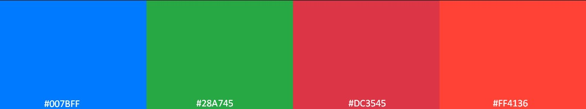
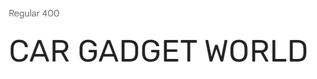

# Car Gadget World

[](https://car-gadget-world-605f69b77cdd.herokuapp.com/)
[Link to Live Site](https://car-gadget-world-605f69b77cdd.herokuapp.com/)


## Introduction

The project is an E-commerce site for a store that sells both universal accessories and branded ones for a specific car brand.

Users, including guests, can view accessories, and only registered users can add them to their cart and place orders.

The project was built with Agile management principles in mind, and I used a lot of GitHub features like Issues and Projects to implement the scrum methodology, even though I was working on my own.

I wanted to create an interface for the business owner to manage the store without logging into the Django admin panel.

[Kanban Board for project](https://github.com/users/satogako/projects/6/views/1)

[Closed Issues on GitHub for the project](https://github.com/satogako/CarGadgetWorld/issues?q=is%3Aissue+is%3Aclosed)

I used [GitHub issues](https://github.com/satogako/CarGadgetWorld/issues) for the product backlog containing the user stories.

I used the tags feature in GitHub Issues for assigning story points, prioritising features based on [the MoSCoW method](https://en.wikipedia.org/wiki/MoSCoW_method).

I used the [Milestones feature](https://github.com/satogako/CarGadgetWorld/milestones?state=closed) to plan sprints and set deadlines.


## User Stories

User stories were prepared using GitHub Issues and assigned story points based on estimated completion time.

User Stories can been seen below under [User Story Testing](#user-story-testing), and in the [GitHub Issues](https://github.com/satogako/CarGadgetWorld/issues?q=is%3Aissue+is%3Aclosed) for full details story points and associated sprints.


## UX

I used the color palette below for the overall design of the site pages:


The following color palette was used for active site elements such as buttons and links:


I used CSS Variables to use my chosen colour palette and font across the project easily.
```
    CSS
:root {
    --font-display-font: 'Rubik', sans-serif;
    --main-bg-color: #f7f7f7;
    --color-primary: #333333;
    --color-secondary: #007bff;
    --color-white: rgba(255, 255, 255, 1);
    --color-gray: rgb(224,224,224);
    --button-color: #28a745;
    --color-red: #ff4136;
    --color-black: #000103;
    --color-off-white: rgba(255, 255, 255, 0.8);
    --color-text: #666666;
    --color-header: #333333;
}
```

I used the version of Bootstrap (5.0), which includes support for CSS Variables. 
I used this new recommended approach along with my own variables to customise bootstrap elements. 

An example of this can be seen on one of the custom classes for button link:
```
    CSS
.btn-home-color:hover{
    background-color: var(--color-black) !important; 
    border-color: var(--color-secondary) !important;
    color: var(--color-white) !important;
}
```
See: [Bootstrap Docs - Root Variables](https://getbootstrap.com/docs/5.0/customize/css-variables/#root-variables)


### Typography

I used the sans-serif font [Rubik](https://fonts.google.com/specimen/Rubik) from Google Fonts. I like its subtle rounded corners and it makes a nice readable display font for the logo and headings.



For the body text, I let Bootstrap style the font as it used a native font stack for different devices resulting in a nice native looking appearance.
See: [Bootstrap Docs - Native Font Stack](https://getbootstrap.com/docs/5.0/content/reboot/#native-font-stack)


### Wireframes

I drew some wireframes using [Balsamiq](https://balsamiq.com/) of the landing page and products page. I knew I had the elements available in Bootstrap to get this layout up and running fast.


### Accessibility

I ensured the website is accessible to people with visual impairments by: 
- Used semantic HTML elements like  ```<header> ,  <nav> ,  <main> ,  <footer>```  etc. This helps screen readers navigate the page. 
- Provided alt attributes for all images. The alt attributes describe the image content to screen readers. For example:
	```
		
	```
- Used Bootstrap components which are accessible by default. For example, Bootstrap buttons, forms, modals etc. come with proper ARIA attributes and keyboard functionality.  
- Adding  aria-label  attributes to icons and links to convey meaning to screen readers. For example:
  ```
    <a href="https://github.com/satogako/CarGadgetWorld"
			target="_blank"
			rel="noopener"
			aria-labelledby="github-repo">
			<i class="fa-brands fa-square-github fa-xl"></i> 
			<span id="github-repo"> Github Repo</span>
    </a>
  ```
- Ensured good color contrast between foreground and background colors to aid low vision users. I used a color contrast checker to verify contrast ratios.
- Ensured all interactive elements are keyboard focusable and the visual focus indicator is clearly visible.


# Features

## Existing Features

### Landing Page

The landing page contains an attractive main image and a headline that provides the user with a brief description of what the store sells.

 Below that is a Shop Now button that prompts the user to see items for sale. The button has a green color and, when pressed, takes on the main colors of the image, which gives the client the effect of starting the car. All this additionally encourages the customer to click and go to the store's accessory sales page.

 <details>
<summary>
Screenshot of the full landing page on desktop and mobile
</summary>


</details>


### Navbar

The navigation panel contains drop-down menus for viewing accessories: by category, by car brand, and by car accessory manufacturer.

Guests see links to Register or Login.

Logged in users will see their username and a dropdown list containing:
- Logout

<details>
<summary>
Screenshot of dropdown for users
</summary>


</details>


In addition to these, staff members have access to:
- Product Management
- Logout

<details>
<summary>
Screenshot of dropdown for staff members
</summary>


</details>


### Shopping cart

Only registered users can add products to their shopping cart, and the cart total is clearly displayed in the navigation bar on large screens and above. On smaller screens, click on the burger button to see the cart total.

On the cart page, users can change the quantity and if they want to remove the accessory from the cart

<details>
<summary>
Screenshots of Shopping Cart on desktop and mobile
</summary>


</details>


### Breadcrumbs

Breadcrumbs are present on all pages, which help the user to quickly orient himself on which page of the store he is on. Also, with the help of Breadcrumbs, the user can go to previous pages that he has already visited.

<details>
<summary>
Screenshot of breadcrumbs on desktop and mobile
</summary>


</details>


### List of All Accesories.

If you are on the All Accessories page, you will see a list of products that are sold in the Сar Gadger World online store.

Each product has:
- Picture. 
- The name of the manufacturer who made this accessory.
- The name of the product.
- Stock Keeping Unit.
- Informing the buyer of which cars the accessory is suitable for, or information that this product is universal and suitable for all brands of cars.
- The price of the accessory has a larger font and is placed on a gray background to make it easier and faster for the buyer to find it.

Sort options are available to sort the list by:
- The newest ones first
- Name (A-Z)
- Name (Y-A)
- Price (low to high)
- Price (from high to low)

<details>
<summary>
Screenshots of the All Accessories page
</summary>


List of accessories with sorting options:


</details>
<br>

**Only staff have access to the buttons:**
- Edit. Allows to edit the accessory.
- Delete. Allows to delete the accessory.


### Product Details Page

The Product Details page provides users with an enlarged image and has the following information about the accessory:
- Enlarged image. 
- The name of the manufacturer who made this accessory.
- The name of the product.
- Stock Keeping Unit.
- Detailed description of the accessory.
- Informing the buyer of which cars the accessory is suitable for, or information that this product is universal and suitable for all brands of cars.
- The price of the accessory has a larger font and is placed on a gray background to make it easier and faster for the buyer to find it.
- A cell for entering the quantity. 
- A button to add the accessory to the shopping cart.

If the user has previously registered, the accessory is added to the cart by clicking the ADD TO CART button, and if not, the user is redirected to the Register page for registration.

If the accessory is not available, instead of the ADD TO CART button, the inactive OUT OF STOCK button is displayed in gray.

<details>
<summary>
Screenshots of Product Detail page
</summary>


</details>
<br>

**Only staff have access to the buttons:**
- Edit. Allows to edit the accessory.
- Delete. Allows to delete the accessory.


### Sign UP / Sign In

Users can register using the Sign UP page or, if the user was previously registered, Sign In on the Login page.

After registration, the Confirm Email page opens, where users are provided with information that the letter has been sent to their mailbox for verification.

<details>
<summary>
Screenshot of Sign UP, Sign In, Confirm Email and Sign Out pages
</summary>


</details>


### Checkout

The ordering process consists of two stages:

1.  - View the order
    - Add delivery address
    
    - Enter payment details
    
2.  - Order confirmation
    

The Checkout page clearly displays the total to be paid. And also under the button COMPLETE ORDER will appear a message which
 will inform the buyer that he will be charged an amount equal to the amount of the order.

 If the user enters incorrect card data, the message "You card number is invalid" will appear under the Payment cell, which clearly informs him about the problem.

All information related to Billing is handled by Stripe.

Billing Address or Card details are **never** saved in the database.


### Footer

The Footer includes:

- A link back to the All Accessories page
- Link to the Subscribe to the Newsletter page.
- A link to the Privacy Policy
- A link to the [GitHub repository for the project](https://github.com/satogako/CarGadgetWorld).

<details>

<summary>Screenshot of Footer on desktop and mobile</summary>


</details>


### Privacy Policy

I included a Privacy Policy link in the Footer which explains how data may be used. I used [Privacy Policy Generator](https://www.privacypolicygenerator.info/) for help writing the policy.

<details>
<summary>
Screenshot of Privacy Policy
</summary>


</details>


### Notifications

Django Notifications and Bootstrap's notification elements have been combined to create elegant notifications that can be dismissed when the user performs an action.

The user, depending on his actions, can receive four types of messages:
- Success notification.
- Informative message.
- Warning.
- Error message.

<details>
<summary>
Screenshots of four types of messages
</summary>


</details>


### Favicon


Users can add a link to the Car Gadget World website to the home screen of their smartphone or tablet if they are using a mobile browser. At the same time, the icon of the website will be displayed on the main screen, as well as the name of the application. Users can conveniently launch the website by clicking on this icon on their device's home screen.

I added theme color and background_color `"theme_color": "#333333",
"background_color": "#333333",` in the site.webmanifest file to give the site a more consistent look in [PWA](https://en.wikipedia.org/wiki/Progressive_web_app) mode and better match its overall color scheme.
